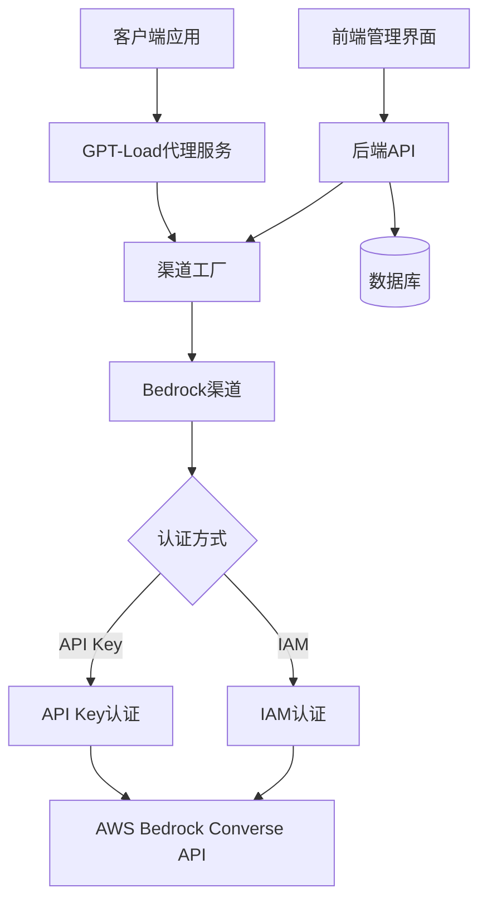
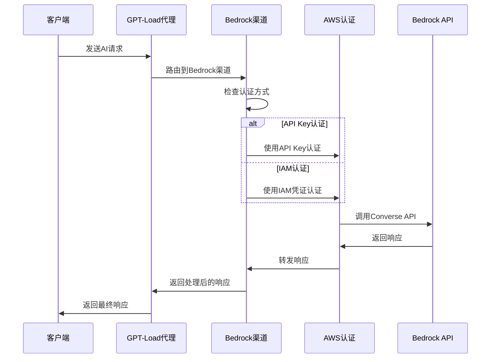

# AWS Bedrock 渠道支持设计文档

## 概述

本设计文档描述了为 GPT-Load 系统添加 AWS Bedrock 渠道支持的技术实现方案。该功能将使用 AWS Bedrock 的 Converse API，支持 API Key 和 IAM 两种认证方式，并提供完整的前端配置界面。

## 架构

### 系统架构图



### 认证流程图



## 组件和接口

### 1. Bedrock 渠道实现 (BedrockChannel)

#### 核心接口实现

```go
type BedrockChannel struct {
    *BaseChannel
    authType     string // "api_key" 或 "iam"
    region       string
    apiKey       string // API Key认证时使用
    accessKeyID  string // IAM认证时使用
    secretKey    string // IAM认证时使用
    sessionToken string // IAM认证时使用（可选）
}
```

#### 主要方法

- `BuildUpstreamURL()`: 构建 Bedrock Converse API 的 URL
- `ModifyRequest()`: 添加 AWS 认证头和必要的请求头
- `IsStreamRequest()`: 检测是否为流式请求
- `ExtractModel()`: 从请求中提取模型名称
- `ValidateKey()`: 验证认证凭证的有效性

### 2. AWS 认证模块 (BedrockAuth)

#### 认证接口

```go
type BedrockAuthenticator interface {
    SignRequest(req *http.Request, region string) error
    ValidateCredentials(ctx context.Context, region string) error
}

type APIKeyAuth struct {
    apiKey string
}

type IAMAuth struct {
    accessKeyID  string
    secretKey    string
    sessionToken string
}
```

#### 认证实现

- **API Key 认证**: 使用 AWS 提供的 API Key 进行简单认证
- **IAM 认证**: 实现 AWS Signature Version 4 签名算法

### 3. 请求转换器 (RequestTransformer)

#### 请求格式转换

```go
type ConverseRequest struct {
    ModelID       string                 `json:"modelId"`
    Messages      []ConverseMessage      `json:"messages"`
    System        []SystemMessage        `json:"system,omitempty"`
    InferenceConfig *InferenceConfig     `json:"inferenceConfig,omitempty"`
    ToolConfig    *ToolConfig            `json:"toolConfig,omitempty"`
    GuardrailConfig *GuardrailConfig     `json:"guardrailConfig,omitempty"`
    AdditionalModelRequestFields map[string]interface{} `json:"additionalModelRequestFields,omitempty"`
}

type ConverseMessage struct {
    Role    string        `json:"role"`
    Content []ContentBlock `json:"content"`
}
```

#### 转换逻辑

- 将标准的 OpenAI 格式请求转换为 Bedrock Converse API 格式
- 处理不同消息类型（文本、图像等）
- 映射参数名称和格式差异

### 4. 响应处理器 (ResponseHandler)

#### 响应格式转换

```go
type ConverseResponse struct {
    Output      ConverseOutput `json:"output"`
    StopReason  string         `json:"stopReason"`
    Usage       Usage          `json:"usage"`
    Metrics     Metrics        `json:"metrics"`
}
```

#### 处理逻辑

- 将 Bedrock 响应转换为标准格式
- 处理流式和非流式响应
- 错误处理和状态码映射

## 数据模型

### 1. 分组配置扩展

在现有的 Group 模型基础上，添加 Bedrock 特定的配置字段：

```json
{
  "channel_type": "bedrock",
  "config": {
    "auth_type": "api_key|iam",
    "region": "us-east-1",
    "api_key": "encrypted_api_key",
    "access_key_id": "encrypted_access_key",
    "secret_access_key": "encrypted_secret_key",
    "session_token": "encrypted_session_token"
  },
  "upstreams": [
    {
      "url": "https://bedrock-runtime.{region}.amazonaws.com",
      "weight": 1
    }
  ],
  "test_model": "anthropic.claude-3-haiku-20240307-v1:0",
  "validation_endpoint": "/model/{model_id}/converse"
}
```

### 2. 前端配置接口

```typescript
interface BedrockConfig {
  authType: "api_key" | "iam";
  region: string;
  apiKey?: string;
  accessKeyId?: string;
  secretAccessKey?: string;
  sessionToken?: string;
}

interface BedrockChannelForm extends GroupFormData {
  bedrockConfig: BedrockConfig;
}
```

## 错误处理

### 1. 认证错误处理

- **无效 API Key**: 返回 401 状态码和具体错误信息
- **IAM 认证失败**: 处理签名错误、权限不足等问题
- **区域配置错误**: 验证 AWS 区域的有效性

### 2. API 调用错误处理

- **模型不存在**: 映射 Bedrock 的模型错误到标准格式
- **配额限制**: 处理 AWS 的限流和配额错误
- **网络错误**: 实现重试机制和降级策略

### 3. 错误映射表

| Bedrock 错误              | HTTP 状态码 | 标准错误格式          |
| ------------------------- | ----------- | --------------------- |
| ValidationException       | 400         | Bad Request           |
| AccessDeniedException     | 403         | Forbidden             |
| ResourceNotFoundException | 404         | Not Found             |
| ThrottlingException       | 429         | Too Many Requests     |
| InternalServerException   | 500         | Internal Server Error |

## 测试策略

### 1. 单元测试

- **认证模块测试**: 测试 API Key 和 IAM 认证的正确性
- **请求转换测试**: 验证请求格式转换的准确性
- **响应处理测试**: 确保响应格式转换的正确性
- **错误处理测试**: 测试各种错误场景的处理

### 2. 集成测试

- **端到端流程测试**: 从客户端请求到 Bedrock 响应的完整流程
- **认证方式切换测试**: 验证两种认证方式的正确切换
- **流式响应测试**: 测试流式请求的处理能力
- **负载测试**: 验证高并发场景下的性能

### 3. 前端测试

- **配置界面测试**: 测试 Bedrock 配置表单的功能
- **认证方式切换测试**: 验证前端认证方式切换的正确性
- **表单验证测试**: 测试输入验证和错误提示
- **用户体验测试**: 确保配置流程的用户友好性

## 实现细节

### 1. AWS SDK 集成

使用 AWS SDK for Go 实现认证和 API 调用：

```go
import (
    "github.com/aws/aws-sdk-go-v2/aws"
    "github.com/aws/aws-sdk-go-v2/config"
    "github.com/aws/aws-sdk-go-v2/credentials"
    "github.com/aws/aws-sdk-go-v2/service/bedrockruntime"
)
```

### 2. 配置管理

- 敏感信息加密存储
- 配置热重载支持
- 环境变量覆盖机制

### 3. 性能优化

- 连接池复用
- 请求缓存机制
- 异步处理优化

### 4. 监控和日志

- 详细的请求日志记录
- 性能指标收集
- 错误率监控
- AWS API 调用统计

## 安全考虑

### 1. 凭证安全

- 所有认证信息加密存储
- 内存中凭证的安全清理
- 访问权限最小化原则

### 2. 网络安全

- HTTPS 强制使用
- 请求签名验证
- 防重放攻击机制

### 3. 数据保护

- 敏感数据脱敏
- 日志信息过滤
- 传输加密保护

## 部署和配置

### 1. 环境要求

- Go 1.21+
- AWS SDK for Go v2
- 支持的 AWS 区域列表

### 2. 配置示例

```yaml
# docker-compose.yml 环境变量示例
environment:
  - AWS_REGION=us-east-1
  - AWS_ACCESS_KEY_ID=your_access_key
  - AWS_SECRET_ACCESS_KEY=your_secret_key
```

### 3. 部署步骤

1. 更新依赖包
2. 配置 AWS 凭证
3. 重启服务
4. 验证功能

## 兼容性

### 1. 向后兼容

- 现有渠道功能不受影响
- 配置格式向后兼容
- API 接口保持一致

### 2. 版本支持

- 支持 AWS Bedrock 最新 API 版本
- 兼容主流 Bedrock 模型
- 支持未来功能扩展

## 文档和培训

### 1. 用户文档

- Bedrock 渠道配置指南
- 认证方式选择建议
- 常见问题解答
- 故障排除指南

### 2. 开发文档

- 代码架构说明
- API 接口文档
- 扩展开发指南
- 测试用例说明
